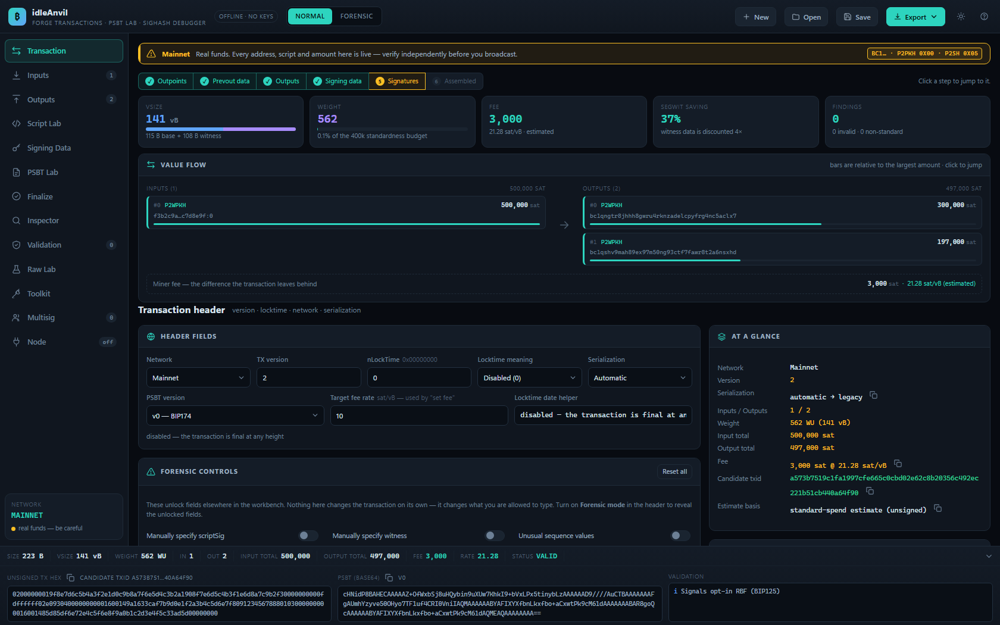
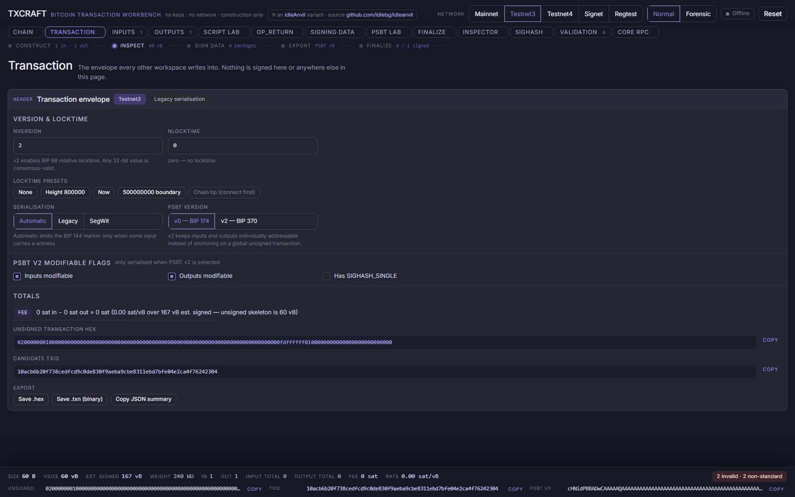
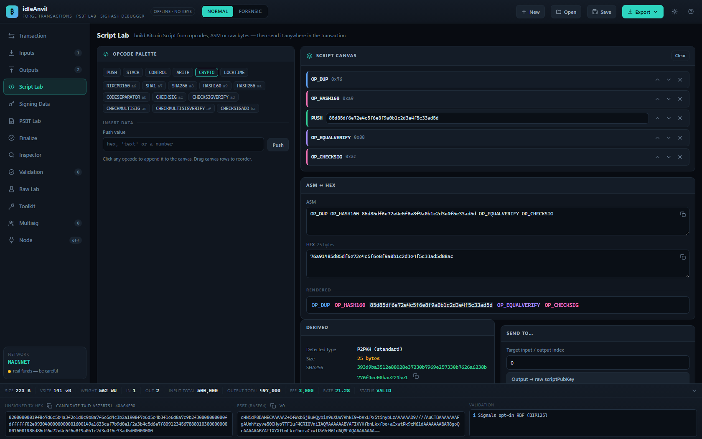
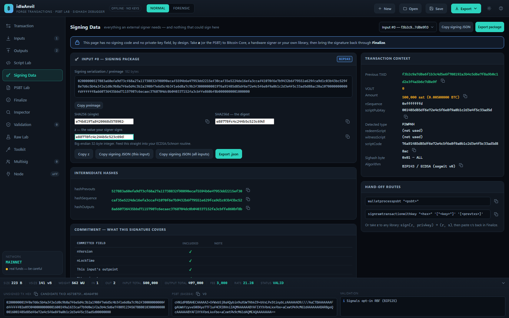
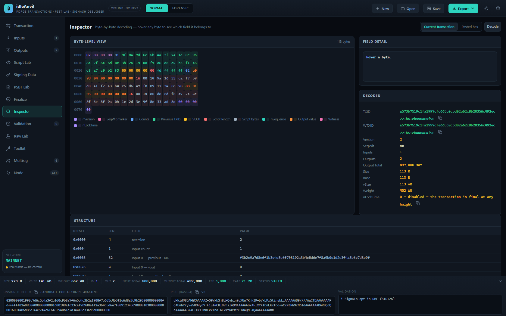
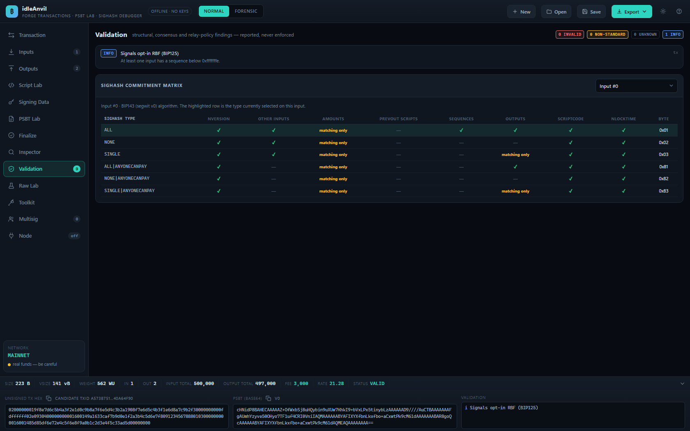
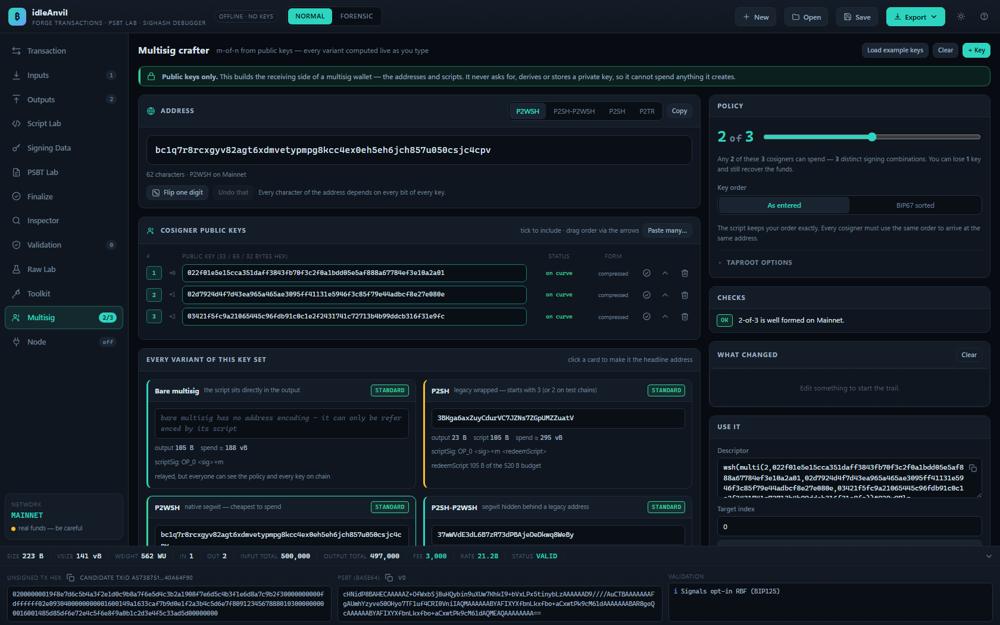

# ⚒️ idleAnvil

**An offline, single-page Bitcoin transaction forge** — crafter, PSBT workbench, sighash
debugger, script laboratory and forensic transaction analyser.

**It constructs, inspects and exports. It never signs.** There is no private-key field
and no signing code anywhere in the source — that separation is the whole point of the
design.

```
construct → inspect → compute signing data → export → sign elsewhere → import signatures → finalize
```

## Live demos — two forges, one brief

This repo ships **two independent implementations** of the same tool. The difference
is the harness, not the model: **idleAnvil** was forged with **Claude Code**,
**TXCRAFT** with the **Claude Design** harness — both by **Claude Fable**. Two
codebases, one set of BIPs, agreeing byte-for-byte on the test vectors. Click a
screenshot to open it — nothing to install, and neither page talks to anyone.

<table>
<tr>
<th align="center"><a href="https://idlebg.com/idleanvil/">⚒️ idleAnvil</a></th>
<th align="center"><a href="https://idlebg.com/idleanvil/txcraft/">⚒️ TXCRAFT</a></th>
</tr>
<tr>
<td align="center"><a href="https://idlebg.com/idleanvil/"></a></td>
<td align="center"><a href="https://idlebg.com/idleanvil/txcraft/"></a></td>
</tr>
<tr>
<td align="center">built with <b>Claude Code</b> · Claude Fable<br>hand-wired classic scripts — this repo's <code>js/</code><br>13 workspaces · 30 templates · deep links</td>
<td align="center">built with <b>Claude Design</b> · Claude Fable<br>one self-contained file — <code>variants/txcraft/</code><br>13 tabs · byte-map inspector · own engine</td>
</tr>
<tr>
<td align="center"><b><a href="https://idlebg.com/idleanvil/">▶ open idleAnvil</a></b></td>
<td align="center"><b><a href="https://idlebg.com/idleanvil/txcraft/">▶ open TXCRAFT</a></b></td>
</tr>
</table>

Deep links open idleAnvil straight into a workspace:
[#multisig](https://idlebg.com/idleanvil/#multisig) ·
[#signing](https://idlebg.com/idleanvil/#signing) ·
[#inspector](https://idlebg.com/idleanvil/#inspector) ·
[#script](https://idlebg.com/idleanvil/#script)

## Running it

Use the [live demo](https://idlebg.com/idleanvil/), or run it locally: download
[**v1.1**](https://github.com/idlebg/idleanvil/archive/refs/tags/v1.1.zip) (all
versions on the [releases page](https://github.com/idlebg/idleanvil/releases)), unzip,
and open `index.html` in Chrome, Edge or Firefox — that is the entire setup. No
server, no build step, no CDN, no dependencies; everything is plain classic scripts,
so it works straight off `file://`. The [TXCRAFT variant](variants/txcraft/) rides
along in the same download as a single self-contained file.

Either way it makes **no network requests at all** unless you explicitly connect it to
a node in the **Node** workspace. The header pill always tells you which state you are
in, and the whole state persists in your browser's localStorage between visits.

## Workspaces at a glance

| Workspace | What it does |
| --- | --- |
| **Transaction** | nVersion, nLockTime (+ height/time interpretation), network, serialization, PSBT version, forensic switches, value-flow diagram, weight-budget meters |
| **Inputs** | Outpoints, prevout amount and script, redeem/witness scripts, full taproot block, per-input sighash and algorithm, manual scriptSig/witness, BIP32 derivations |
| **Outputs** | Address mode, 30 script templates, raw ASM↔hex, and a dedicated OP_RETURN builder |
| **Script Lab** | Opcode palette by category, drag-reorderable canvas, ASM ↔ hex, and derived P2SH / P2WSH / tapleaf values |
| **Signing Data** | Preimage, intermediate hashes, digest and `z` per input, plus the commitment breakdown |
| **PSBT Lab** | Build and decode BIP174 v0 / BIP370 v2, key-by-key structure view, Bitcoin Core command helpers |
| **Finalize** | Import signed PSBT / DER / Schnorr / r,s / signing JSON / raw tx; assemble scriptSig and witness |
| **Inspector** | Byte-level colour-coded decode; hover any byte to see its field |
| **Validation** | Consensus, structural and relay-policy findings, plus the sighash commitment matrix |
| **Raw Lab** | Hash calculator, DER surgery, address ↔ script, byte utilities, taproot bench, signature verification |
| **Toolkit** | Output descriptors, extended-key decoding, taproot tree builder, unit/base/time conversion, size estimator, pubkey tools, merkle root, script analyser |
| **Multisig** | m-of-n wallet crafter from public keys, with every script variant and a live address diff |
| **Node** | Optional live chain data over an Electrum WebSocket — fees, UTXOs, prevout fetch, guarded broadcast |

## Your first transaction — explained like you're six

Think of your bitcoin as **coins inside little glass boxes**. Everyone can see the
boxes, but each one only opens for the person holding the right key. Making a
transaction means: open some boxes, pour the coins into new boxes with other people's
locks on them, and leave a small tip on the table so the miners will carry it.

idleAnvil is the workbench where you prepare all of that. It never holds your key —
it writes a note, and your key signs the note somewhere else.

1. **Pick the boxes to open.** In **Inputs**, describe the coin you are spending: the
   txid (the box's serial number), the vout (which slot in that box), how much is
   inside, and its scriptPubKey (the shape of the lock). Connected to a node? Press
   **Fetch prevout from node** and it fills all of that in for you.
2. **Say where the coins go.** In **Outputs**, paste the destination address and an
   amount. Usually you add a second output back to yourself — the *change*, like the
   coins a vending machine returns.
3. **The tip sets itself.** You never type a fee anywhere. Whatever the inputs hold
   and the outputs don't claim is the miners' tip: `inputs − outputs = fee`. The
   bottom bar shows it live in sat/vB, and **Send remaining** does the arithmetic.
4. **The anvil writes the permission slip.** Open **Signing Data**. The long number
   called **z** is a fingerprint of everything you just decided — signing z means
   agreeing to exactly this transaction and no other.
5. **Take the slip to your key.** Export the PSBT (or copy z, or grab one of the
   generated signer scripts) and sign wherever your key lives — Bitcoin Core, a
   hardware wallet, a few lines of Python. idleAnvil has no key slot, on purpose.
6. **Bring the signature back.** In **Finalize**, paste the signed PSBT — or the DER,
   Schnorr, r/s or JSON forms. Signatures are checked against z before they attach.
7. **Hammer it together.** Press **Assemble** — the signatures get packed into the
   scriptSig and witness in exactly the right order, and the final hex appears with
   its *actual* size and fee.
8. **Mail it.** Broadcast from the **Node** workspace — it lists every destination
   and asks you to confirm, and on mainnet you must literally type `BROADCAST` — or
   copy the hex into `bitcoin-cli sendrawtransaction`.

Practice on **testnet or regtest** first: same rules, play money. The **Validation**
workspace is the grown-up checking your homework at every step.

## The workspaces in detail

### Transaction

The home view. Header fields cover nVersion (clamped to the standard 1–3 in normal
mode; any int32 in forensic), nLockTime with a live height/time interpretation and a
date helper, the network selector, serialization mode (auto / legacy / segwit) and the
PSBT version. Around them: a network ribbon; a **pipeline strip** (construct → sign →
finalize) derived from actual state — each step lights up as it completes and clicking
one jumps to the right workspace; **stat tiles** for vSize (with a base/witness meter),
weight against the 400k WU standardness budget, fee and rate, the segwit saving, and
open findings; a **value-flow diagram** of inputs → outputs with proportional bars —
click any row to jump to its card; the forensic control panel; and one-click demo
transactions (P2WPKH spend, OP_RETURN, taproot, multisig) to start from something real.

### Inputs

One card per input. The outpoint (txid/vout), prevout amount and scriptPubKey — with
the script rendered as syntax-highlighted ASM and its type detected live. nSequence
comes with presets (Final · RBF · locktime-only · CSV 144) and a plain-English
explanation of what the current value actually signals. Below: redeemScript and
witnessScript fields; a full **taproot block** (internal key, merkle root, tapleaf
script and version, control block, annex) that derives the tweak, output key and
address as you type; signature settings (ECDSA/Schnorr, sighash type, ANYONECANPAY,
plus a forensic custom sighash byte and scriptCode override); manual scriptSig and
witness-stack editors; PSBT material (partial signatures, taproot signatures, BIP32
derivations, the full parent transaction); and a derived-context panel showing the
exact scriptCode and hash algorithm this input's signature will use. With a node
connected, **Fetch prevout** fills amount, script and parent transaction in one click.

### Outputs

Amounts in sats with a live BTC mirror, **send remaining** and subtract-fee helpers.
Four creation modes: **address** (validated against the selected network, with the
reason when it fails), **template** — 30 script templates spanning single-key forms,
multisig, tapscripts, CLTV/CSV timelocks, hashlocks, a full HTLC, a CSV vault,
degrading multisig, data-carriers, P2A and arbitrary witness programs — **raw ASM**
(opcode names, `<hex>` pushes, `'strings'`, numbers), and a dedicated **OP_RETURN
builder** with six payload encodings, push-encoding control, one-click protocol
prefixes (Omni, Runes, Stacks…) and, in forensic mode, multi-push and non-minimal
encodings. The resolved scriptPubKey renders underneath with dust and zero-value
badges.

### Script Lab



An opcode palette grouped by category — hover any chip for its documentation and hex
value; reserved and disabled opcodes join the palette in forensic mode. Build on a
drag-reorderable canvas or type ASM/hex directly; both stay in sync in either
direction. The derived panel computes the script's detected type, SHA256 and HASH160,
its P2SH and P2WSH addresses and scriptPubKeys, and its tapleaf hash — and one click
sends the result to an output, or to an input as redeemScript, witnessScript, tapleaf
or scriptSig.

### Signing Data



Pick an input and get everything an external signer needs: the exact preimage bytes,
the intermediate hashes (hashPrevouts / hashSequence / hashOutputs for BIP143;
sha_prevouts / sha_amounts / sha_scriptpubkeys / sha_sequences / sha_outputs for
BIP341), the single SHA256, and the final digest **z**. The algorithm — legacy, BIP143
or BIP341 — is chosen from the prevout automatically, with warnings when required data
is missing. A **commitment table** shows precisely which transaction fields this
signature covers under the selected sighash type. Export signing JSON for one input or
all, or generate a ready-to-run signer in six flavours: Python/coincurve, pure-Python
ecdsa, python-bitcoinlib (which recomputes the sighash independently and asserts it
matches), JavaScript/@noble/curves, Bitcoin Core CLI, and verify-only.

### PSBT Lab

The transaction as a live PSBT — v0 (BIP174) or v2 (BIP370) — in base64 and hex, with
a binary `.psbt` download. Paste or drop any PSBT to decode it key by key with
human-readable values (amounts, script types, sighash names, derivation paths, witness
stacks) and a per-input signature diff against what you are building; one click loads
it into the editor. Bitcoin Core helpers print `decodepsbt`, `analyzepsbt`,
`walletprocesspsbt`, `finalizepsbt`, `testmempoolaccept` and `sendrawtransaction`
with your actual data already filled in.

### Finalize

Five import routes: a signed **PSBT** (merge signatures, or replace the transaction
outright), a **DER signature** + pubkey (verified against `z` before it attaches), a
**Schnorr signature** (64 or 65 bytes, key or script path), raw **r/s** (DER-encoded
for you, with optional low-S normalisation), and **signing JSON** (single object or
array). The assembler then builds canonical unlocking data per input — P2PKH/P2PK
scriptSigs, P2WPKH witnesses, P2SH and its nested-segwit forms, P2WSH multisig with
the BIP147 empty dummy and signatures in key order, and taproot key-path or
script-path witnesses with positional CHECKSIGADD slots — and reports the **actual**
(no longer estimated) size, fee and rate for the final hex.

### Inspector



The serialized transaction — the one you are building, or any pasted hex — as a hex
grid where every byte is colour-coded by field. Hover or click a byte to see the field
it belongs to, its offset, length, raw bytes and decoded value; a structure table
lists every field with offsets. Decodes segwit and legacy alike, computes
txid / wtxid / weight, and can load whatever you pasted into the editor.

### Validation



Every finding in one list, graded VALID / NON-STANDARD / INVALID / UNKNOWN: structural
rules (zero inputs or outputs, duplicate outpoints, malformed txids), script
consistency (redeemScript vs the P2SH hash, witnessScript vs the P2WSH program, the
taproot tweak vs the output key), signature checks (DER strictness, low-S, sighash
byte legality per input type), economics (fee sanity, Bitcoin Core's exact dust
thresholds, OP_RETURN datacarrier policy, the weight and minimum-size rules) and
locktime/sequence coherence. Below it, the **sighash commitment matrix**: for the
selected input's algorithm, exactly which fields every sighash type commits to.

### Raw Lab

A hash calculator (SHA256, SHA256d and its reversed form, RIPEMD-160, HASH160, SHA-1,
plus any BIP340 tagged hash) over hex, UTF-8, ASCII or base64 input. **DER surgery**:
decode a signature into r and s, low-S verdict, the N−s complement, the trailing
sighash byte, every strictness deviation, and the two candidate R points for its
x-coordinate. An r/s → DER builder with low-S normalisation; address ↔ script
conversion in both directions; a taproot bench (leaf hash, tweak, output key, address
and control block from raw parts); **ECDSA and Schnorr verification** against any
digest, with one click to fill `z` from the current input; and byte utilities
(reverse, varint, CScriptNum, u32/u64 LE, base64, text, push encoding).

### Toolkit

Output **descriptors** — eleven BIP380 patterns with the checksum computed, verified
and corrected, plus descriptors derived from the transaction you are building. An
**extended-key decoder** for xpub/ypub/zpub/tpub/vpub… (version, depth, parent
fingerprint, child number, chain code, key, own fingerprint — private keys are
recognised and their material deliberately withheld). A **taproot tree builder**: any
number of leaves → balanced merkle tree, root, tweak, output key, address, and a
control block + merkle path per leaf, with one-click NUMS and apply-to-input. Unit
conversion (sat ↔ bit ↔ mBTC ↔ BTC with a live dust check — sub-sat input is refused,
never silently truncated), base conversion (decimal / hex / binary / octal / base58 /
base64, CScriptNum, varint, little-endian), a **locktime & sequence lab**
(interpretation, ETAs, date → locktime, BIP68 relative-timelock encode/decode), a
size & fee **estimator** for arbitrary input/output mixes, a **public-key toolkit**
(compress ↔ decompress ↔ x-only, parity, hashes, every address form), block-style
**merkle roots** (with the CVE-2012-2459 duplicate rule), and a **script analyser**
(type, size, worst-case sigops, OP_IF nesting, and the consensus limits it is near).

### Multisig



Builds the receiving side of an m-of-n wallet **from public keys only**. Every key is
validated on-curve with the reason when it fails; keys can be excluded and re-included,
reordered, or BIP67-sorted (`multi` vs `sortedmulti` — toggle it to see why sorting
exists). **All five script forms are computed at once** — bare multisig, P2SH,
P2SH-P2WSH, P2WSH and a taproot `OP_CHECKSIGADD` k-of-n — each with its address,
output size, spend cost in vbytes, spending template, standardness verdict and a
checksummed descriptor. The headline address renders character by character with
changes highlighted; **Flip one digit** mutates a random hex digit in a random key so
you can watch ~90 % of the address change, with undo and a fourteen-state history
trail. One click sends the address to an output, sets an input up to spend it (with a
signature slot pre-seeded per cosigner), opens the script in Script Lab, checks the
address against a connected node, or downloads a wallet JSON with every variant.

### Node

Optional and off by default. Speaks the Electrum protocol over WebSocket (Fulcrum's
`ws =` / `wss =` listener) with a configurable endpoint per network. On connect the
server's **genesis hash is checked** against the selected network — a mismatch gets a
loud warning instead of quietly wrong data. Once live: a fee table across
confirmation targets showing the resulting fee for *your* transaction with one-click
"use this rate"; UTXO scans by address or script with add-as-input; transaction
fetch / decode / spend-from; per-input prevout fetch; and broadcast behind a mandatory
confirmation dialog that lists every destination — on mainnet you must additionally
type `BROADCAST`. Every request and response appears in the traffic log.

### Always on screen

A fixed bottom console tracks size, vSize, weight, input/output totals, fee and rate,
the live unsigned hex, the live PSBT base64 and the current validation verdict —
whatever workspace you are in. Keys `1`–`9`, `0`, `-`, `=` and `m` switch workspaces;
`Ctrl+S` / `Ctrl+O` save and open project files; `Ctrl+E` copies the unsigned hex.

## TXCRAFT — the sibling forge

The second forge in the demo table above: **[TXCRAFT](variants/txcraft/)** — the
same brief implemented **independently**, as a single self-contained file, by
Claude Fable through the **Claude Design** harness (where idleAnvil itself was
forged with **Claude Code**). Its own Bitcoin engine, its own design system, the
same never-signs boundary — which makes the two forges useful checks on each
other: two codebases, one set of BIPs, agreeing byte-for-byte on the vectors.

**Try it: [idlebg.com/idleanvil/txcraft](https://idlebg.com/idleanvil/txcraft/)** —
or grab [`variants/txcraft/txcraft-standalone.html`](variants/txcraft/) (one file,
React and all, works from `file://`) and read its
[README](variants/txcraft/README.md). It ships with its own 43-check harness
(`node variants/txcraft/verify.js`), anchored to the BIP143 and BIP86 vectors.
Cross-links run both ways: TXCRAFT's header carries an *idleAnvil variant* chip, and
this app's About dialog points at TXCRAFT.

## Networks

**Mainnet** · Testnet3 · Testnet4 (BIP94) · Signet · Regtest — all five fully enabled,
with mainnet as the default. The network controls address encoding and validation;
change it at any time and addresses re-encode against the new network, with mismatches
flagged rather than silently accepted. Mainnet gets an amber ribbon reminding you the
values are live.

## Normal vs Forensic mode

Forensic mode unlocks the fields wallet software deliberately hides: manual scriptSig
and witness, arbitrary nVersion, non-minimal pushes, custom sighash bytes, duplicate
inputs, zero-value and dust outputs, malformed DER, high-S signatures, arbitrary opcodes
and raw script bytes.

Nothing is ever blocked. Every unusual construction is *labelled* instead:

- **VALID** — standard, will relay
- **NON-STANDARD** — consensus-valid but poorly relayed
- **INVALID** — consensus failure
- **UNKNOWN** — not enough information to judge

Use regtest or a testnet for experiments.

## Getting a signature back in

Five routes, all handled in **Finalize**:

1. **PSBT** — export, sign in Bitcoin Core / a hardware signer / any PSBT wallet, paste
   the result back. idleAnvil diffs it against the current transaction and reports which
   inputs gained a signature.
2. **DER signature** + public key — verified against `z` before being accepted.
3. **Schnorr signature** — 64 or 65 bytes, key path or script path.
4. **r / s** — DER-encoded for you, with optional low-S normalisation.
5. **Signing JSON** — the interchange format below.

### Signing JSON

Export from **Signing Data** (or Export → signing package):

```json
{
  "network": "testnet3",
  "input": 0,
  "txid": "…", "vout": 1, "amount": 10000,
  "scriptPubKey": "…", "scriptCode": "…",
  "sighash": "ALL", "sighashByte": "0x01",
  "algorithm": "ecdsa", "hashAlgorithm": "bip143",
  "preimage": "…", "digest": "…", "z": "…"
}
```

Return this shape and paste it into Finalize → Signing JSON:

```json
{ "input": 0, "r": "…", "s": "…", "der": "…", "pubkey": "…" }
```

or, for taproot:

```json
{ "input": 0, "schnorr": "…", "pubkey": "…", "leafHash": "…" }
```

The Signing workspace also generates ready-to-run signer snippets in six flavours —
Python/coincurve, Python/ecdsa, Python/python-bitcoinlib (which recomputes the sighash
independently and asserts it matches), JavaScript/@noble/curves, Bitcoin Core CLI, and
a verify-only variant. Each prints JSON in exactly the shape Finalize imports.

## Connecting a node (optional)

**Local WebSocket support is built in** — idleAnvil ships with a complete
Electrum-over-WebSocket client; the only thing you configure is the server side.
Browsers cannot open raw TCP or SSL sockets, so your Fulcrum needs a WebSocket
listener enabled:

```ini
# fulcrum.conf
ws = 50002       # what idleAnvil connects to  (use wss = <port> for TLS)
tcp = 50001      # fine for Electrum wallets — a browser cannot use these two
ssl = 50003
```

Default endpoints are `ws://127.0.0.1:50002` for testnet3/testnet4, `:50003` for
signet, `:50004` for mainnet and `:50001` for regtest — all editable per network in
the workspace. Modern browsers exempt `127.0.0.1` from mixed-content blocking, so
even the hosted demo at idlebg.com can talk to a Fulcrum running on *your own*
machine; for a remote server, put it behind TLS and use a `wss://` endpoint.
Verified against Fulcrum 2.1.1.

What connecting adds: chain height and live block notifications · `estimatefee` across
1/2/3/6/12/25 blocks with one-click "use this rate" · UTXO lookup for any address or
script with one-click "add as input" · a **fetch prevout** button on every input that
fills in the amount, scriptPubKey and full parent transaction · raw transaction fetch
and decode · broadcast behind a mandatory confirmation (mainnet additionally requires
typing `BROADCAST`).

Off by default, genesis hash checked on connect, every request visible in the traffic
log, and still no private keys — the page holds none.

## What is implemented from scratch

SHA-256 · RIPEMD-160 · SHA-1 · BIP340 tagged hashes · secp256k1 point arithmetic ·
ECDSA verification · BIP340 Schnorr verification · Base58Check · Bech32 (BIP173) ·
Bech32m (BIP350) · transaction serialization (BIP144) · script assembler and
disassembler · CScriptNum · legacy signature hashing (including the SIGHASH_SINGLE
bug) · BIP143 · BIP341 SigMsg · BIP341 taproot tweaking, tapleaf and tapbranch
hashing · BIP174 · BIP370 · DER encode/decode with strictness and low-S analysis.

## Verification

```
node verify.js
```

No dependencies, Node 16+. The in-repo harness loads the exact browser modules and runs
**90 checks**: the BIP143 official P2WPKH worked example byte-for-byte, Bitcoin Core's
dust thresholds (546 / 540 / 294 / 330), OP_RETURN datacarrier policy at the exact
83-byte boundary, BIP341 sighash-byte validity (all seven legal types accepted,
everything else rejected), the sighash commitment matrix across algorithms,
multisig finalization (BIP147 empty dummy, key-ordered signatures, positional
CHECKSIGADD slots), BIP125 sequence semantics, size-estimator figures derived
byte-by-byte, BigInt-exact varints, and lossless-only unit conversion.

Run it after any change to `js/`.

## Files

```
index.html            markup, icon sprite, script tags
css/idleanvil.css     design system, light + dark themes
js/crypto.js          SHA-256, RIPEMD-160, SHA-1, secp256k1, taproot tweaks, DER, verification
js/encoding.js        hex, varint, base58check, bech32, bech32m, base64, byte reader/writer
js/script.js          opcodes, ASM assembler/disassembler, templates, address ↔ script, networks
js/tx.js              transaction model, serialization, weight accounting, raw decoding
js/sighash.js         legacy, BIP143 and BIP341 signature hashes + commitment model
js/psbt.js            BIP174 v0 and BIP370 v2 build / parse / describe / merge
js/validate.js        consensus + policy checks, and input finalization
js/tools.js           descriptors, extended keys, taproot trees, conversions, estimator, code generation
js/multisig.js        m-of-n construction from public keys
js/node.js            optional Electrum-over-WebSocket client
js/ui.js              state, rendering and wiring
verify.js             regression harness — `node verify.js`
```

## Caveats

- Size and fee figures for an unsigned transaction are **estimates** based on standard
  spend templates. Once real signatures are attached, the Finalize panel reports actual
  figures.
- Validation reports relay-policy defaults. Individual nodes and miners may differ.
- Verify anything independently before broadcasting on mainnet. This is a bench, not an
  authority.

## Contributing

Keep it dependency-free and boring to deploy: plain classic scripts, no build step,
no bundler, nothing fetched at runtime. Before opening a PR, run `node verify.js`
(the 90-check harness must stay green) and load `index.html` with a clean console.
Bug reports that include a transaction hex, a PSBT, or a failing `verify.js`
assertion are the most actionable kind.

## License

[MIT](LICENSE)
